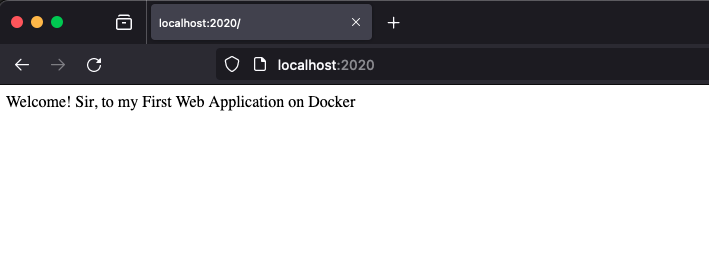
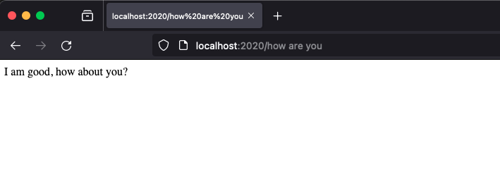

# My First Web App on Docker Repo

## Description

This is a simple web application using Python Flask and used it in my docker image. When it will run in docker container it will print "Welcome! Sir, to my First Web Application on Docker" message on Browser and you can input in browser url "how are you" and it will return "I am good, how about you?" output on browser. Further, docker file/image for running this application will be created. In the end i will upload docker image to docker hub.

## Required Dependencies

- Ubuntu (Base Docker image) 
- Python3 (Programming Language)
```bash
      apt-get install -y python3
```
- Pip (Package installer for Python)
```bash
      apt-get install -y python3-pip
```
- Flask (Web application framework)
```bash
      pip install flask
```
## Create Docker File

In my-webapp directory i will create Docker file using command:
```bash
      cat > Dockerfile
```
then add following lines and save it 
```make
#Pull Base image from Docker
FROM ubuntu

#Copy main server runner file app.py to container path
COPY app.py app.py

#Copy requirements/dependencies file to container path
COPY requirements.txt requirements.txt

#Install Dependencies
RUN apt-get update
RUN apt-get install -y python3
RUN apt-get install -y python3-pip
RUN pip install -r requirements.txt # Install flask

#Command to run when the container started
ENTRYPOINT FLASK_APP=app.py flask run --host=0.0.0.0
```
## Application File

Create my application file in my-webapp directory with name "app.py" using command:
```bash
      cat > app.py 
```
then copy my sample code to it.
```python
import os
from flask import Flask
app = Flask(__name__)

@app.route("/")
def main():
    return "Welcome! Sir, to my First Web Application on Docker"

@app.route('/how are you')
def hello():
    return 'I am good, how about you?'

if __name__ == "__main__":
    app.run(host="0.0.0.0", port=2020)
```
## Docker Build Image
For Building my Docker image below command is used
```bash
      docker build . -t irehankhan/my-webapp:1.0
```
You can see below log
```bash
irehankhan@Rehans-Mac-mini my-webapp2 % docker build . -t irehankhan/my-webapp:1.0
[+] Building 1.3s (12/12) FINISHED                                          docker:desktop-linux
 => [internal] load .dockerignore                                                           0.0s
 => => transferring context: 2B                                                             0.0s
 => [internal] load build definition from Dockerfile                                        0.0s
 => => transferring dockerfile: 538B                                                        0.0s
 => [internal] load metadata for docker.io/library/ubuntu:latest                            1.2s
 => [1/7] FROM docker.io/library/ubuntu@sha256:2b7412e6465c3c7fc5bb21d3e6f1917c167358449fe  0.0s
 => [internal] load build context                                                           0.0s
 => => transferring context: 63B                                                            0.0s
 => CACHED [2/7] COPY app.py app.py                                                         0.0s
 => CACHED [3/7] COPY requirements.txt requirements.txt                                     0.0s
 => CACHED [4/7] RUN apt-get update                                                         0.0s
 => CACHED [5/7] RUN apt-get install -y python3                                             0.0s
 => CACHED [6/7] RUN apt-get install -y python3-pip                                         0.0s
 => CACHED [7/7] RUN pip install -r requirements.txt                                        0.0s
 => exporting to image                                                                      0.0s
 => => exporting layers                                                                     0.0s
 => => writing image sha256:2012a08748e7253f6293505183b3c029e9c2665950d3d2112244a0cf1cc196  0.0s
 => => naming to docker.io/irehankhan/my-webapp:1.0                                         0.0s

What's Next?
  View a summary of image vulnerabilities and recommendations → docker scout quickview
```
To confirm docker image creation use below command

```bash 
      docker images
```
```bash
irehankhan@Rehans-Mac-mini my-webapp2 % docker images
REPOSITORY             TAG       IMAGE ID       CREATED         SIZE
irehankhan/my-webapp   1.0       2012a08748e7   9 minutes ago   450MB
```

## Docker Container Run
To Run docker container of my docker image use below command (For attached mode)
```bash
    docker run -p 2020:5000 --name my-webapp-container irehankhan/my-webapp:1.0
```
For Detached Mode
```bash
    docker run -d -p 2020:5000 --name my-webapp-container irehankhan/my-webapp:1.0
```
Below is the output. <i>2020 is the host port binded with container port 5000</i>
```bash
irehankhan@Rehans-Mac-mini my-webapp2 % docker run -p 2020:5000 --name my-webapp-container irehankhan/my-webapp:1.0
 * Serving Flask app 'app.py'
 * Debug mode: off
WARNING: This is a development server. Do not use it in a production deployment. Use a production WSGI server instead.
 * Running on all addresses (0.0.0.0)
 * Running on http://127.0.0.1:5000
 * Running on http://172.17.0.2:5000
Press CTRL+C to quit
192.168.65.1 - - [01/Nov/2023 14:56:30] "GET / HTTP/1.1" 200 -
192.168.65.1 - - [01/Nov/2023 14:56:39] "GET /how%20are%20you HTTP/1.1" 200 -
```
## Test
Open a browser and go to URL
```html
  http://<ip_address>:2020                           => Welcome! Sir, to my First Web Application on Docker
  http://<ip_address>:2020/how%20are%20you            => I am good, how about you?
```



## Push Docker Image to Docker Hub
Now we have to push Docker Image which we have created and tested

First Login to Docker Hub using below command and enter credentials 
```bash
      docker login 
```
then push docker image to docker hub using below command
```bash
      docker push irehankhan/my-webapp:1.0
```
<i> Note: While pushing docker image to docker hub repository add your username of docker hub for successful operation.</i>

Below is the output
```bash
irehankhan@Rehans-Mac-mini my-webapp2 % docker login
Authenticating with existing credentials...
Login Succeeded
irehankhan@Rehans-Mac-mini my-webapp2 % docker push irehankhan/my-webapp:1.0
The push refers to repository [docker.io/irehankhan/my-webapp]
1a1afc31a7f8: Pushed 
833d1d3d20bb: Pushed 
f0678936a62d: Pushed 
f50ba1f4b09e: Pushed 
b0df353cff35: Pushed 
03a306b41ceb: Pushed 
d2d3127fc3d3: Layer already exists 
1.0: digest: sha256:950dcbae8428fe9a1e57b52e3ad9dc1249e4c4c07023da80d26f12d90b91da9a size: 1791
irehankhan@Rehans-Mac-mini my-webapp2 %
```
### To Access Docker Hub Repository
Please use below link and pull/run (irehankhan/my-webapp:1.0) Repository
```html
    https://hub.docker.com/r/irehankhan/my-webapp
```
### Accessing Docker Image from Docker Hub
To check if docker image file is pushed properly and working after fetching from Docker Hub Repository
```bash
irehankhan@Rehans-Mac-mini my-webapp2 % docker run -p 2020:5000 --name my-webapp-container irehankhan/my-webapp:1.0
Unable to find image 'irehankhan/my-webapp:1.0' locally
1.0: Pulling from irehankhan/my-webapp
bfbe77e41a78: Already exists 
f92b21dca95a: Already exists 
488af52b9599: Already exists 
b7107114a22b: Already exists 
237811ef9117: Already exists 
34bff8bbff49: Already exists 
d48324f9a486: Already exists 
Digest: sha256:950dcbae8428fe9a1e57b52e3ad9dc1249e4c4c07023da80d26f12d90b91da9a
Status: Downloaded newer image for irehankhan/my-webapp:1.0
 * Serving Flask app 'app.py'
 * Debug mode: off
WARNING: This is a development server. Do not use it in a production deployment. Use a production WSGI server instead.
 * Running on all addresses (0.0.0.0)
 * Running on http://127.0.0.1:5000
 * Running on http://172.17.0.2:5000
Press CTRL+C to quit
192.168.65.1 - - [01/Nov/2023 15:19:04] "GET / HTTP/1.1" 200 -
192.168.65.1 - - [01/Nov/2023 15:20:55] "GET /how%20are%20you HTTP/1.1" 200 -
```
## Github Logs for my Teacher
```bash
  irehankhan@Rehans-Mac-mini my-webapp2 % git init
hint: Using 'master' as the name for the initial branch. This default branch name
hint: is subject to change. To configure the initial branch name to use in all
hint: of your new repositories, which will suppress this warning, call:
hint: 
hint: 	git config --global init.defaultBranch <name>
hint: 
hint: Names commonly chosen instead of 'master' are 'main', 'trunk' and
hint: 'development'. The just-created branch can be renamed via this command:
hint: 
hint: 	git branch -m <name>
Initialized empty Git repository in /Users/irehankhan/Documents/my-webapp2/.git/
irehankhan@Rehans-Mac-mini my-webapp2 % git checkout -b main
Switched to a new branch 'main'
irehankhan@Rehans-Mac-mini my-webapp2 % git status
On branch main

No commits yet

Untracked files:
  (use "git add <file>..." to include in what will be committed)
	Dockerfile
	README.md
	app.py
	image-1.png
	image.png
	requirements.txt

nothing added to commit but untracked files present (use "git add" to track)
irehankhan@Rehans-Mac-mini my-webapp2 % git add .
irehankhan@Rehans-Mac-mini my-webapp2 % git status
On branch main

No commits yet

Changes to be committed:
  (use "git rm --cached <file>..." to unstage)
	new file:   Dockerfile
	new file:   README.md
	new file:   app.py
	new file:   image-1.png
	new file:   image.png
	new file:   requirements.txt

irehankhan@Rehans-Mac-mini my-webapp2 % git commit -m "INITIAL COMMIT"
[main (root-commit) ec5574c] INITIAL COMMIT
 6 files changed, 303 insertions(+)
 create mode 100644 Dockerfile
 create mode 100644 README.md
 create mode 100644 app.py
 create mode 100644 image-1.png
 create mode 100644 image.png
 create mode 100644 requirements.txt
irehankhan@Rehans-Mac-mini my-webapp2 % git remote add origin git@github.com:irehankhan/my-webapp.git
irehankhan@Rehans-Mac-mini my-webapp2 % git branch -M main
irehankhan@Rehans-Mac-mini my-webapp2 % git push -u origin main
Enumerating objects: 8, done.
Counting objects: 100% (8/8), done.
Delta compression using up to 8 threads
Compressing objects: 100% (7/7), done.
Writing objects: 100% (8/8), 37.71 KiB | 12.57 MiB/s, done.
Total 8 (delta 0), reused 0 (delta 0), pack-reused 0
To github.com:irehankhan/my-webapp.git
 * [new branch]      main -> main
branch 'main' set up to track 'origin/main'.
```
<h1></h1>
<h1 style="text-align: center;">Thank You!</h1>

